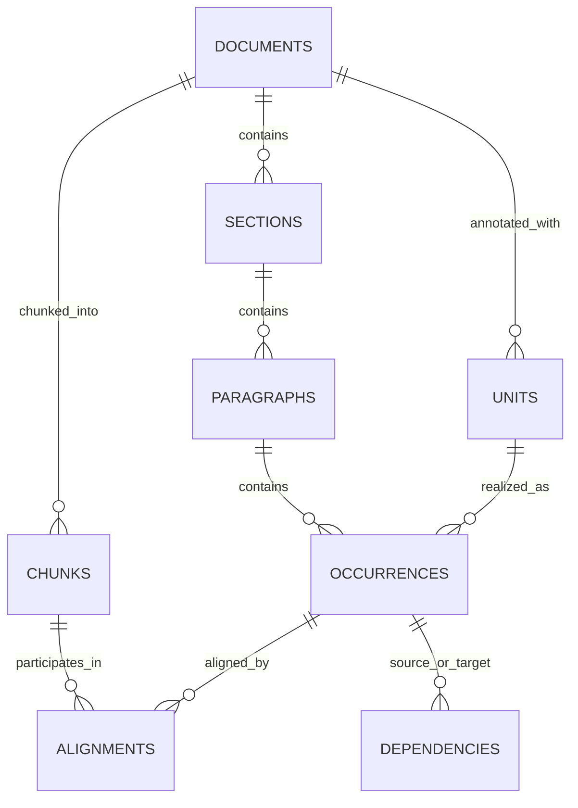

# Data Schema

The paths described below refer to the complete dataset hosted at
[LevenKoko/MIRAGE-CanaryDocs](https://huggingface.co/datasets/LevenKoko/MIRAGE-CanaryDocs).

## Stable identifiers

- `document_id` is the root identifier.
- `section_id` references one document; `paragraph_id` references one section.
- `chunk_id` references one document and an ordered token window.
- `unit_id` identifies one document-level Gold unit.
- `occurrence_id` identifies one exact surface occurrence.
- `alignment_id` joins an occurrence to a chunk with `intersects` or `fully_contains`.
- `relation_id` joins consecutive occurrences of the same unit.

Character and token spans are zero-based, half-open intervals. JSONL rows are sorted by stable IDs or
document order. The normalized files under `data/` are canonical; files under `views/` are materialized
convenience representations.
